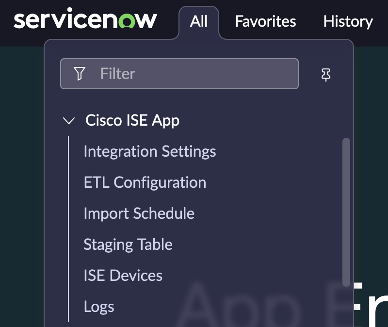
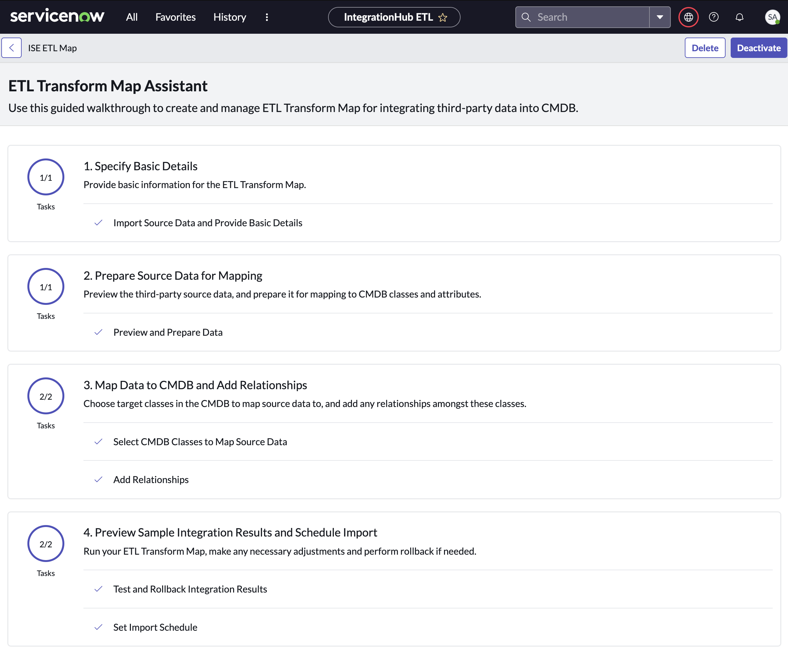
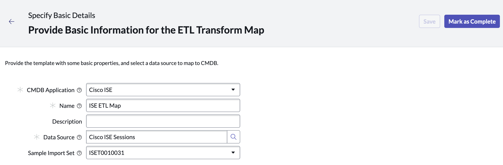

# Cisco ISE App for ServiceNow

The Cisco ISE App for ServiceNow provides a complete, accurate and up-to-date view of your network connected assets integrated with ServiceNow’s CMDB. It helps you automatically true-up your CMDB for all connected IT and IOT assets by continuously sharing device properties and additional network context leveraging Cisco ISE [pxGrid](https://developer.cisco.com/docs/pxgrid/#!what-is-pxgrid). By combining Cisco’s ability to create a real-time directory of all connected assets, high-fidelity data from every device with the power of ServiceNow workflows, organizations get information to those who need it faster, more accurately and more efficiently:
- Allow ServiceNow CMDB users to view ISE Session Directory Information, such as MAC Address, IP Address, Device Type, Compliance Status, Network Device, Location, etc. without the need to access ISE’s GUI.
- Allow ServiceNow CMDB administrators to classify and enrich the asset information in the CMDB providing better service management and monitoring.
- Allow other ServiceNow CMDB integrated products to have better context around assets.

### Existing Integration
The existing Cisco ISE & ServiceNow Integration allows for CMDB information to be used in ISE Policies. 

For more information on the existing integrations, please see the [ISE pxGrid Direct with CMDBs Webinar](https://www.youtube.com/watch?v=g8fzBPY8gU8) or [ise-servicenow on DevNet](https://developer.cisco.com/codeexchange/github/repo/CiscoDevNet/ise-servicenow/)

## Integration Overview
- This ServiceNow Scoped Application leverages the [Integration Hub ETL](https://docs.servicenow.com/en-US/bundle/vancouver-servicenow-platform/page/product/configuration-management/concept/integrationhub-etl.html) to aggregate Cisco ISE’s live asset data with existing assets in your CMDB.
- Allows for customization of mapping of your ISE Devices and attributes data to cmdb_ci structure in ServiceNow.
- Define import schedule for data to be synced from ISE into ServiceNow.

## Architecture Diagram

## Dependencies
- [ServiceNow Tokyo Release](https://www.servicenow.com/blogs/2022/welcome-now-platform-tokyo-release.html) or Above
- Cisco ISE [Version 3.2](https://www.cisco.com/c/en/us/support/security/identity-services-engine/products-release-notes-list.html) or Above

### ServiceNow Application Dependencies
- [ITOM Licensing](https://docs.servicenow.com/en-US/bundle/vancouver-it-operations-management/page/product/it-operations-management/reference/itom-su-licensing-landing-page.html)
- [Integration Commons for CMDB](https://docs.servicenow.com/en-US/bundle/store-release-notes/page/release-notes/store/platform-capabilities/store-cmdb-rn-integration-commons.html)
- [IntegrationHub ETL](https://docs.servicenow.com/en-US/bundle/store-release-notes/page/release-notes/store/platform-capabilities/store-integrationhub-rn-etl.html)
- [MID Server](https://docs.servicenow.com/bundle/tokyo-servicenow-platform/page/product/mid-server/concept/mid-server-landing.html)

## Installation & Setup Video
COMING SOON

## Installation Instructions
### 1. Deploy a MID Server (Required) - [Documentation](https://docs.servicenow.com/en-US/bundle/vancouver-servicenow-platform/page/product/mid-server/concept/mid-server-installation.html)
**Note** If ISE does not use a publicly trusted certificate for ERS or pxGrid a MID Certificate Policy can be used to disable Certificate Chain Check.

 

### 2. Import the App via Source Control 
1. Click the Fork button on this page.
2. Select your personal GitHub account as the fork Owner, then click the Create fork button.
3. Create credentials to access your repository. [Example #1](https://snprotips.com/blog/2022/3/4/how-to-change-servicenow-applications-repositoryurl) | [Example #2](https://developer.servicenow.com/dev.do#!/learn/learning-plans/tokyo/new_to_servicenow/BNI_Lab_ForkRepo_tokyo)
4. On your ServiceNow Instance, navigate to System Applications > Studio
5. Select File > Import From Source Control and enter the repository URL, Credential, select master as the branch and click Import. 

 

### 3. Configure Integration Settings. 
1. From your instance homepage, navigate to Cisco ISE App > Integration Settings. (Note: All required navigation for the App is in the Cisco ISE Application Menu 

2. Configure the pxGrid Node (FQDN or IP Address)
3. Configure the pxGrid Port (Default is 8910)
4. Configure the pxGrid Account Name (Must be unique from other integrations)
5. Select the MID Server to be used for the integration and enter the MID Server Name.
  

6. Select the ERS Settings Tab - ERS is used to approve the pxGrid account in ISE.
7. Configure the ERS Node (Typically the Primary Administration Node)
8. Configure the ERS Port (Default is 9060)
9. Configure the ERS Username and Password (User should be in the ERS-Admin Group. [More Info](https://developer.cisco.com/docs/identity-services-engine/latest/#!setting-up/cisco-ise)) 

10. Verify your settings and click Update.

### 4. Verify pxGrid Provisioning completes successfully 

## Extract, Transform, & Load Configuration
From your instance homepage, navigate to **Cisco ISE App > ETL Configuration**.  
 

Use the guided setup on the ETL Transform Map Assistant page to customize the integration data mappings to target CMDB classes based on source data. (ServiceNow Documentation: [ Create an ETL transform map](https://docs.servicenow.com/bundle/tokyo-servicenow-platform/page/product/configuration-management/concept/create-etl-transform-map.html))

### Step 1. Provide Basic Information for the ETL Transform Map
Select a Sample Import Set or auto-pull a new one to review your data. When finished click **Mark as Complete**.

### Step 2. Prepare Source Data for Mapping
Pre-configured transform of ISE Session Directory fields have been provided, but you can customize or cleanse the source data here. When finished click **Mark as Complete**.

### Step 3. Map Data to CMDB and Add Relationships
Pre-configured mappings leverage endpoint profile as the source criteria have been provided, but you can customize the conditional class mapping and relationships. When finished click **Mark as Complete**.

Click on **Edit Mappings** to customize the source data fields to CMDB field mappings.

On the Relationship mapping page, configure relationships between CIs based on your ISE Session Data. (E.g. Device to Network Adapter, User to Device)

### Step 4. Preview Sample Integration Results
Click on Test and Rollback Integration Results and then **Run Integration**. 

Verify your results and then click **Mark as Complete**.

### Step 5. Schedule Import
From the Cisco ISE App menu, click on Import Schedule. 
 
Check the box next to **Active** and setup a schedule for running the import of ISE data. The default is set to one hour but should be customized based on the environment of the deployment.  
 
**Note**: From the Import Schedule page, **Execute Now** can be used to run the import on-demand.

## Staging Table
The ISE Sessions imported will be put into a staging table prior to the Robust Transform Engine processing the record. The data is kept for 7 days by default, but can be modified in your ServiceNow configuration.
 

 

## Limitations of the App
- This is Proof of Concept(PoC) code and should be customized and tested prior to production deployment. Please see [license](https://github.com/ModernCyber/servicenow-ise/blob/master/LICENSE) disclaimer & details.
- No ISE High Availability Support
- No Multiple ISE Deployments
- No pxGrid Cloud Support

## Production Deployment & Support
For additional design, implementation or support services, please contact [ModernCyber](https://www.moderncyber.com/contact/) to learn about our premium offerings and support.